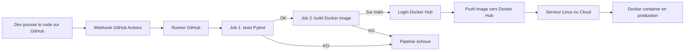

# Architecture du pipeline CI/CD



## Architecture observability

```mermaid
flowchart LR
    U[Utilisateur / navigateur] --> A[Flask app sur la VM]
    A --> M[/metrics]
    A --> H[/health]
    M --> P[Prometheus]
    H --> B[Blackbox exporter]
    B --> P
    N[node_exporter] --> P
    C[cAdvisor] --> P
    P --> G[Grafana dashboard]
    P --> AM[Alertmanager]
    AM --> E[Email]
```

## Lecture du schéma

- Le code part de GitHub
- GitHub Actions déclenche le pipeline
- Un runner exécute les jobs
- Les tests valident le code
- Docker construit l'image
- Docker Hub stocke l'image
- Le serveur cible peut ensuite la récupérer et la lancer

## Lecture de la couche observabilité

- Flask expose des métriques sur `/metrics`
- Prometheus collecte les métriques et exécute les règles d’alerte
- Grafana lit Prometheus et affiche les graphes
- Blackbox exporter vérifie `/health` depuis l’extérieur
- node_exporter mesure la VM
- cAdvisor mesure les conteneurs
- Alertmanager prépare l’envoi d’alertes email
