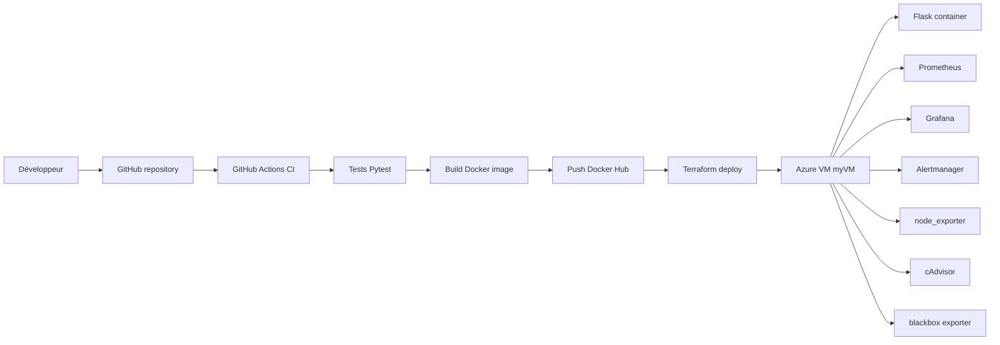

# Guide complet du projet Flask CI/CD sur Azure

Ce document récapitule tout le projet, du code Flask jusqu’au déploiement Azure et à l’observabilité avec Prometheus et Grafana.

## 1) Objectif du projet

L’objectif est de construire un mini-projet DevOps réaliste qui montre :

- une application Flask simple
- des tests automatisés avec Pytest
- une image Docker publiée sur Docker Hub
- un pipeline CI/CD avec GitHub Actions
- un déploiement automatisé sur une VM Azure existante
- une couche d’observabilité avec Prometheus, Grafana, Alertmanager, node_exporter, cAdvisor et blackbox exporter

Ce projet sert à comprendre comment un flux DevOps complet fonctionne dans une entreprise.

## 2) Architecture globale



## 3) Concepts clés

### CI
Continuous Integration. Chaque changement de code est vérifié automatiquement.

### CD
Continuous Delivery ou Continuous Deployment.
- Delivery : on prépare un déploiement prêt à être appliqué
- Deployment : on déploie automatiquement vers la cible

### Pipeline
Chaîne complète d’automatisation : test, build, push, deploy.

### Workflow GitHub Actions
Fichier YAML qui décrit le pipeline.

### Job
Bloc logique du workflow.

### Step
Action ou commande dans un job.

### Runner
Machine qui exécute les jobs GitHub Actions.

### Docker Image
Package immuable de l’application.

### Docker Container
Instance en cours d’exécution de l’image.

### Docker Registry
Endroit où stocker les images Docker.

### Docker Hub
Registry utilisé dans ce projet.

### Terraform
Infrastructure as Code. Décrit et applique la configuration Azure.

### Self-hosted runner
Runner GitHub installé sur ta VM Azure.

### Managed identity
Identité Azure de la VM, utilisée pour l’authentification Terraform.

### Prometheus
Collecte des métriques via scraping HTTP.

### Grafana
Visualisation des métriques et dashboards.

### Alertmanager
Envoi et routage des alertes Prometheus.

## 4) Structure du dépôt

```text
flask-azure-devops-pipeline/
├── app.py
├── requirements.txt
├── Dockerfile
├── tests/
│   └── test_app.py
├── .github/
│   └── workflows/
│       ├── ci-cd.yml
│       └── terraform-azure.yml
├── infra/
│   └── terraform/
│       └── azure/
│           ├── main.tf
│           ├── locals.tf
│           ├── outputs.tf
│           ├── variables.tf
│           ├── versions.tf
│           ├── terraform.tfvars.example
│           ├── scripts/
│           │   └── deploy_observability.sh.tftpl
│           └── monitoring/
│               ├── docker-compose.yml
│               ├── prometheus/
│               │   ├── prometheus.yml
│               │   └── rules.yml
│               ├── alertmanager/
│               │   └── alertmanager.yml
│               ├── blackbox/
│               │   └── blackbox.yml
│               └── grafana/
│                   ├── dashboards/
│                   │   └── flask-observability.json
│                   └── provisioning/
│                       ├── dashboards/
│                       │   └── dashboards.yml
│                       └── datasources/
│                           └── datasource.yml
├── docs/
│   ├── architecture.md
│   ├── azure-local-deploy.md
│   ├── azure-self-hosted-runner.md
│   ├── cv-description.md
│   ├── linkedin-description.md
│   └── project-complete-guide.md
└── README.md
```

## 5) L’application Flask

### Endpoints

- `GET /` : message JSON de bienvenue
- `GET /health` : état de santé simple
- `GET /metrics` : métriques Prometheus

### Ce que mesure `/metrics`

- nombre de requêtes
- temps de réponse
- distribution de latence

### Pourquoi c’est utile

Les métriques permettent à Prometheus et Grafana de voir :

- l’activité de l’application
- sa performance
- les dégradations de service

## 6) Les tests Pytest

Les tests vérifient que :

- `/` répond correctement
- `/health` est disponible
- `/metrics` expose bien les métriques Prometheus

### Pourquoi c’est important

Dans une entreprise, les tests empêchent de livrer une version cassée.
Ils sont la base de la CI.

## 7) Docker

### Rôle du Dockerfile

Le Dockerfile construit l’image de l’application.

### Ce qui se passe

1. on copie le code
2. on installe les dépendances
3. on expose le port de l’app
4. on démarre Flask avec Gunicorn

### Pourquoi Docker est utilisé

- environnement reproductible
- déploiement rapide
- même image en local, CI et production

## 8) GitHub Actions

Le fichier principal est `.github/workflows/ci-cd.yml`.

### Jobs du workflow CI/CD

#### Job 1: `test`

- checkout du dépôt
- setup Python
- installation des dépendances
- exécution de Pytest

#### Job 2: `monitoring-validation`

- validation du fichier `docker-compose.yml`
- validation de la config Prometheus
- validation des règles d’alerte
- validation de la config Alertmanager

#### Job 3: `build-and-push`

- build de l’image Docker
- login Docker Hub
- push de l’image sur `main`

#### Job 4: `terraform-deploy`

- s’exécute sur le runner self-hosted de la VM Azure
- prépare Terraform
- fait `fmt`, `init`, `validate`, `plan`, puis `apply`
- redéploie la VM extension si nécessaire

### Pourquoi découper en jobs

- séparation des responsabilités
- lisibilité
- exécution parallèle possible
- débogage plus simple

## 9) Terraform et Azure

Terraform ne crée pas la VM ici.
Il gère une **VM extension** sur `myVM`.

### Ce que fait l’extension

- installe Docker
- écrit les fichiers de monitoring
- télécharge l’image Docker Hub
- démarre les conteneurs

### Pourquoi c’est intéressant

On transforme un serveur manuel en serveur géré par code.

### Déploiement automatique

Le pipeline GitHub Actions peut lancer Terraform sur un self-hosted runner installé sur la VM.

### Variables utilisées

- `AZURE_SUBSCRIPTION_ID`
- `AZURE_RESOURCE_GROUP`
- `AZURE_VM_NAME`

### Ressources Azure manipulées

- groupe de ressources
- VM existante
- extension Custom Script
- identity managée de la VM

## 10) Azure self-hosted runner

Le runner GitHub est installé sur `myVM`.

### Pourquoi

- pas besoin d’Entra ID pour une app registration
- le déploiement se fait directement sur la VM
- Terraform utilise la managed identity locale

### Vérifications nécessaires

- le runner doit être `Online` dans GitHub
- le label doit contenir `azure-vm`
- la VM doit avoir une managed identity activée
- l’identité doit avoir le rôle `Contributor` sur `myResourceGroupTerraform`

## 11) Prometheus

Prometheus collecte les métriques en scrappant des endpoints HTTP.

### Cibles configurées

- `flask-app:/metrics`
- `node_exporter:9100`
- `cadvisor:8080`
- `blackbox_exporter` sur `/health`

### Comment ça marche

1. Prometheus lit `prometheus.yml`
2. il appelle chaque cible à intervalle régulier
3. il stocke les séries temporelles
4. Grafana peut interroger ces données

### Pourquoi c’est utile

- surveillance temps réel
- alertes
- historique des performances

## 12) Grafana

Grafana sert à visualiser les métriques.

### Accès

Grafana n’est pas exposé publiquement.
On y accède avec un tunnel SSH vers `localhost:3000`.

### Connexion

- user : `admin`
- password : `ChangeMe123!`

### Ce qu’on voit dans le dashboard

- taux de requêtes Flask
- latence p95
- CPU de la VM
- état des targets

## 13) Alertmanager

Alertmanager reçoit les alertes de Prometheus.

### Rôle

- regrouper les alertes
- filtrer
- envoyer des notifications

### Déclencheurs du projet

- application down
- health check en échec
- VM trop chargée
- disque ou mémoire élevés

## 14) Le flux de bout en bout

1. Tu modifies le code
2. Tu pushes sur GitHub
3. GitHub Actions lance les tests
4. Le build Docker est généré
5. L’image est poussée sur Docker Hub
6. Terraform redéploie la VM extension
7. La VM récupère l’image
8. Le conteneur démarre
9. Prometheus scrape les métriques
10. Grafana affiche les dashboards

## 15) Commandes utiles

### Lancer le projet en local

```powershell
python -m venv .venv
.venv\Scripts\Activate.ps1
pip install -r requirements.txt
pytest -q
python app.py
```

### Construire l’image Docker

```powershell
docker build -t benharbfarah/ci_cd_pipeline .
docker run -p 5000:5000 benharbfarah/ci_cd_pipeline
```

### Se connecter en SSH à la VM

Si ta clé est sur Linux/Cloud Shell :

```bash
chmod 600 /home/farah/newkey.pem
ssh -i /home/farah/newkey.pem azureuser@4.223.128.175
```

Si tu es sur Windows PowerShell :

```powershell
ssh -i "C:\Users\Farah\Downloads\newkey.pem" azureuser@4.223.128.175
```

### Vérifier que tu es sur la VM

```bash
hostname
whoami
```

### Vérifier les conteneurs

```bash
docker ps
```

### Vérifier l’application

```bash
curl http://localhost:80/
curl http://localhost:80/health
curl http://localhost:80/metrics
```

### Vérifier Prometheus

Depuis la VM :

```bash
curl http://localhost:9090/-/ready
```

Depuis ton PC, via tunnel SSH :

```bash
ssh -i "C:\Users\Farah\Downloads\newkey.pem" -L 9090:127.0.0.1:9090 azureuser@4.223.128.175
```

Puis ouvrir :

```text
http://localhost:9090
```

### Vérifier Grafana

Depuis ton PC, via tunnel SSH :

```bash
ssh -i "C:\Users\Farah\Downloads\newkey.pem" -L 3000:127.0.0.1:3000 azureuser@4.223.128.175
```

Puis ouvrir :

```text
http://localhost:3000
```

Login Grafana :

- user : `admin`
- password : `ChangeMe123!`

## 16) Comment ouvrir Grafana et Prometheus dans le navigateur

### Grafana

1. Ouvre un tunnel SSH vers `localhost:3000`
2. Ouvre `http://localhost:3000`
3. Connecte-toi avec `admin / ChangeMe123!`

### Prometheus

1. Ouvre un tunnel SSH vers `localhost:9090`
2. Ouvre `http://localhost:9090`
3. Va dans `Status > Targets`

## 17) Comment tester le monitoring

### Vérifier les targets

Dans Prometheus :

- `flask-app` doit être `UP`
- `node_exporter` doit être `UP`
- `cadvisor` doit être `UP`
- `blackbox-flask-health` doit être `UP`

### Générer des métriques Flask

Sur la VM :

```bash
curl http://localhost:80/
curl http://localhost:80/health
curl http://localhost:80/
```

### Vérifier dans Grafana

- les panneaux de requêtes doivent se remplir
- les latences doivent apparaître
- la CPU de la VM doit être visible

## 18) Dépannage courant

### SSH refuse la clé

Vérifie les permissions :

```bash
chmod 600 newkey.pem
```

### `permission denied (publickey)`

- mauvaise clé
- mauvais utilisateur
- clé non chargée dans Cloud Shell

### `docker compose` absent

```bash
apt-get update
apt-get install -y docker-compose-plugin
```

### `docker-compose` v1 plante avec `ContainerConfig`

Utiliser `docker compose` v2, pas `docker-compose`.

### `curl localhost:80` refuse la connexion

- le conteneur Flask n’est pas démarré
- la stack Docker Compose n’est pas montée

### Prometheus voit `404` sur `/metrics`

- l’image Docker déployée est ancienne
- il faut rebuild/pull la nouvelle image

## 19) Ce qu’il faut savoir expliquer en entretien

Tu dois pouvoir expliquer :

- pourquoi Pytest protège le déploiement
- pourquoi Docker rend le pipeline reproductible
- pourquoi GitHub Actions automatise la CI/CD
- pourquoi Terraform rend Azure déclaratif
- pourquoi Prometheus, Grafana et Alertmanager forment une chaîne d’observabilité
- pourquoi un self-hosted runner peut être utile
- pourquoi une managed identity est plus propre qu’un secret long terme

## 20) Résultat final du projet

À la fin, tu as :

- une application Flask testée
- une image Docker publiée automatiquement
- un déploiement Azure automatisé
- un stack d’observabilité fonctionnel
- un projet crédible pour un portfolio Cloud & DevOps
